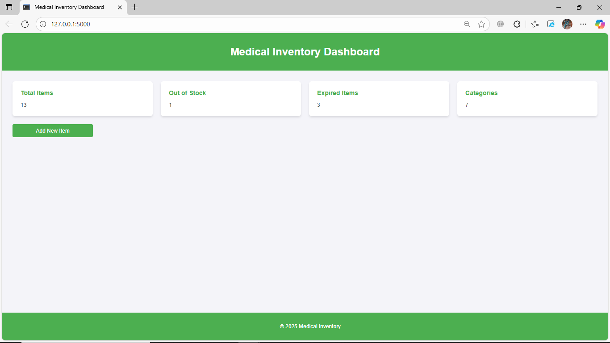
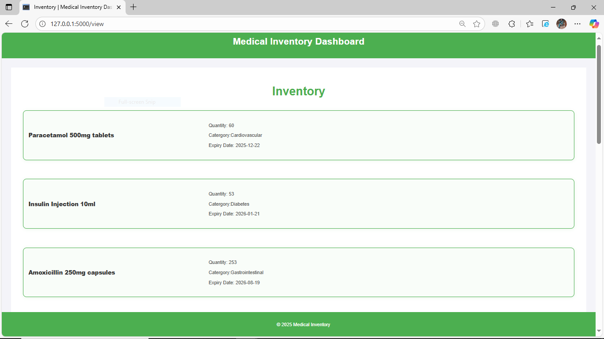
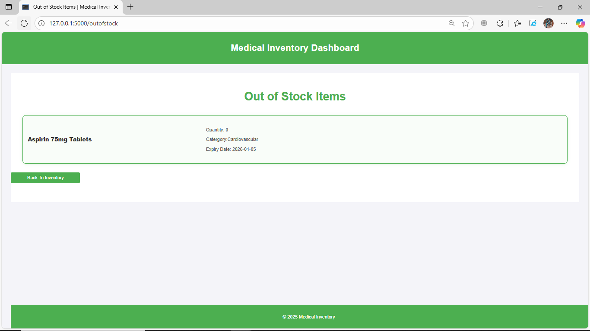
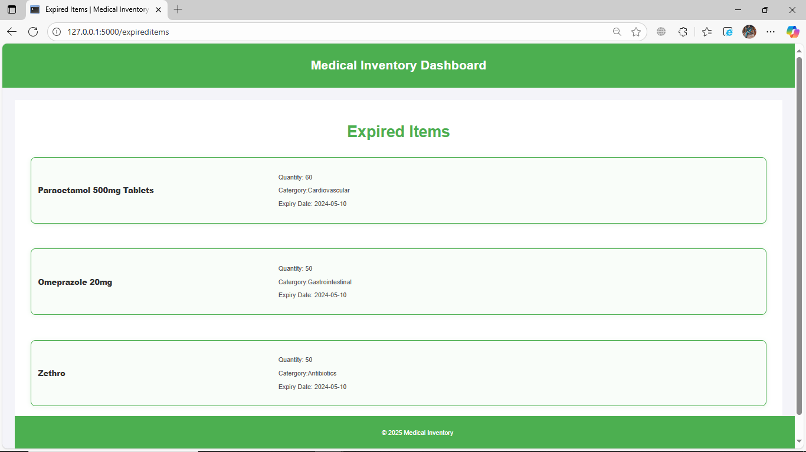
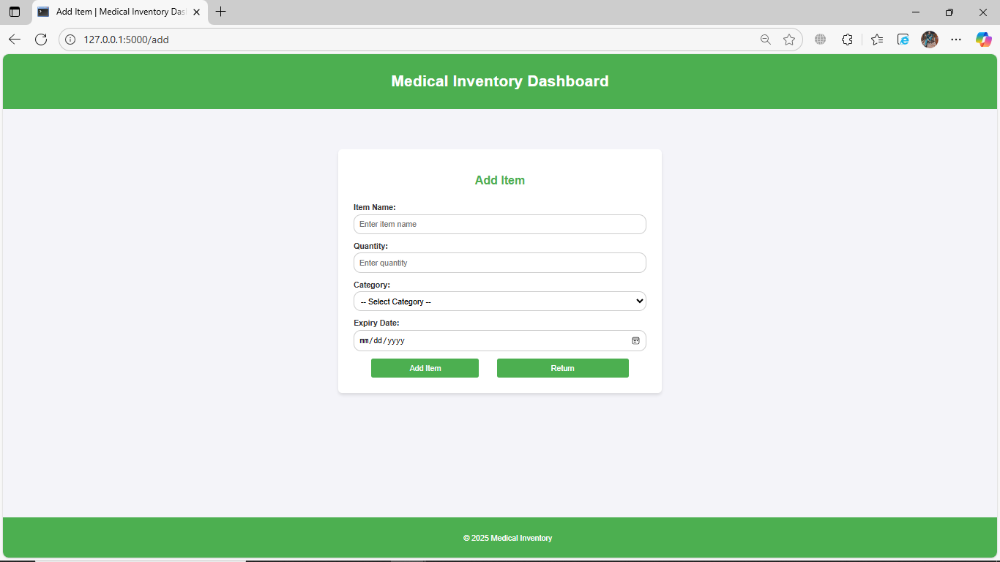
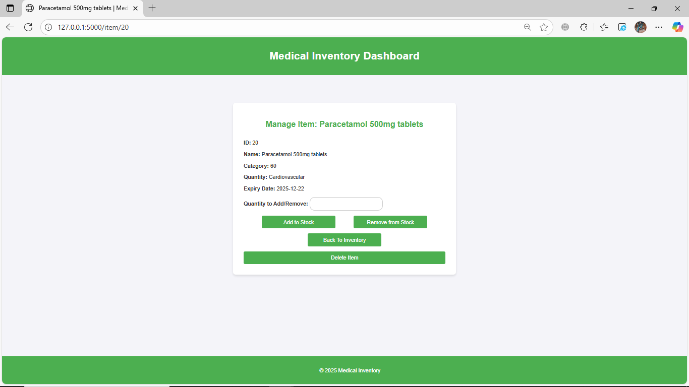

# 🏥 Medical Inventory Management System

A web-based inventory management system for tracking medicines and supplies in a clinic or pharmacy.  
Built with **Flask, Python, and MySQL/SQLite**.

---

## 🚀 Features
- Add, update, and delete medicines.
- Track quantity, category, and expiry date.
- Prevent adding expired stock.
- Auto-update quantity if item already exists.
- Item details page with stock management (add/remove/delete).
- Simple and clean interface.

---

## 📸 Snapshots
  
  
  
  
  


---

## ⚙️ Installation

1. **Clone the repository**
   ```bash
   git clone https://github.com/YourUsername/medical-inventory.git
   cd medical-inventory
Create virtual environment

bash
Copy code
python -m venv venv
source venv/bin/activate   # macOS/Linux
venv\Scripts\activate      # Windows
Install dependencies

bash
Copy code
pip install -r requirements.txt
Run the app

bash
Copy code
flask run
🗄️ Database Schema (MySQL Example)
sql
Copy code
CREATE TABLE items (
  id INT AUTO_INCREMENT PRIMARY KEY,
  name VARCHAR(255) NOT NULL,
  category VARCHAR(100),
  quantity INT NOT NULL DEFAULT 0,
  expiry_date DATE NOT NULL
);
SQLite version works with the same schema (without AUTO_INCREMENT).

📂 Project Structure
csharp
Copy code
medical-inventory/
│── routes.py
│── requirements.txt
│── README.md
│── .gitignore
│── static/
│    └── style.css
│── templates/
│    ├── base.html
│    ├── index.html
│    ├── add.html
│    └── itemdetails.html
│── docs/
│    └── images/
📦 Requirements
See requirements.txt for the full list.

Main dependencies:

Flask

mysql-connector-python (or sqlite3 for SQLite)

python

